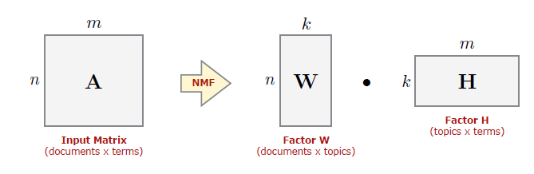
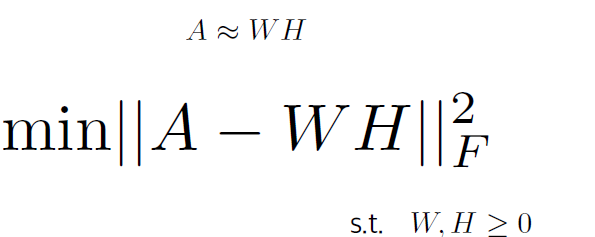

# Non-negative Matrix Factorization (NMF) with Multiplicative Update and Initialization Methods

This repository provides Python implementations for Non-negative Matrix Factorization (NMF) using the Multiplicative Update (MU) algorithm. Two initialization methods are supported: random initialization and Non-negative Double Singular Value Decomposition (NNDSVD). NMF is a matrix factorization technique used in various fields, including topic modeling, collaborative filtering, and dimensionality reduction.

## NMF Algorithm
Non-negative Matrix Factorization (NMF) is a family of linear algebra algorithms used for identifying the latent structure within data represented as a non-negative matrix. For a comprehensive overview, check out this [YouTube tutorial](https://youtu.be/o4pPTwsd-5M?si=dWtts9M32-VqurcX).

<br>

<br>

### Objective:
Given an input matrix \( A \) and a rank \( k \), NMF approximates \( A \) as the product of two non-negative matrices \( W \) and \( H \), where \( W \) and \( H \) are \( k \)-dimensional factors.

<b>Objective Function:</b> The goal is to minimize the following function:

<br>

<br>

There are several approaches to solving this minimization problem. This implementation uses the <b>Multiplicative Update Method</b>, introduced by Lee and Seung in 1999. For more details, refer to [this paper](https://www.researchgate.net/publication/2480786_Multiplicative_Updates_for_Nonnegative_Quadratic_Programming_in_Support_Vector_Machines).

## NNDSVD Method
The <b>Multiplicative Update</b> is an iterative method and can be sensitive to the initializations of \( W \) and \( H \). To improve convergence, this repository includes the <b>NNDSVD Method</b>, an SVD-based initialization introduced by C. Boutsidis and E. Gallopoulos in 2007. More details can be found in [this paper](https://www.sciencedirect.com/science/article/abs/pii/S0031320307004359).

## Key Features:
- **Random Initialization**: Initializes the factor matrices \( W \) and \( H \) with random values.
- **NNDSVD Initialization**: Provides a smarter initialization using Singular Value Decomposition (SVD) to improve convergence.
- **Multiplicative Update Algorithm**: Performs iterative updates to minimize the Frobenius norm between the input matrix \( A \) and the product of \( W \) and \( H \).
- **Configurable Parameters**: Allows specifying the rank of factorization, maximum iterations, and initialization mode.
- **Track Convergence**: Returns the Frobenius norm at each iteration to monitor convergence.

## Functions:
1. **`random_initialization(A, rank)`**: 
   Randomly initializes matrices \( W \) and \( H \).
   
2. **`nndsvd_initialization(A, rank)`**: 
   Initializes \( W \) and \( H \) using NNDSVD for improved factorization.

3. **`multiplicative_update(A, k, max_iter, init_mode='random')`**: 
   Performs the NMF algorithm with multiplicative updates and tracks the convergence.

## Usage:
```python
import numpy as np

# Input matrix A (non-negative)
A = np.random.rand(10, 10)

# Rank of the factorization
rank = 3

# Random initialization example
W_rand, H_rand = random_initialization(A, rank)
```
## Dependencies
- **NumPy**: The code relies on NumPy for matrix operations.

## Applications
- **Topic Modeling**: Decompose a term-document matrix to identify topics in text.
- **Collaborative Filtering**: Factorize a user-item matrix for recommendation systems.
- **Dimensionality Reduction**: Reduce the dimensionality of large datasets while preserving non-negativity.

Feel free to explore and modify the code to suit your NMF needs!
